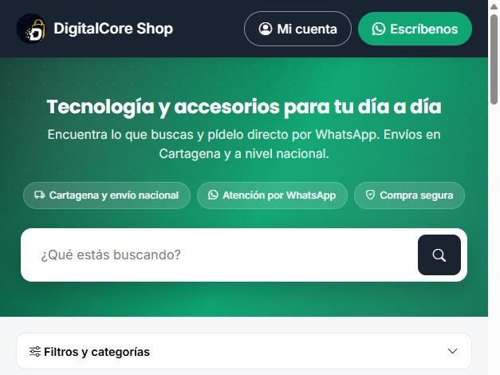

# DigitalCore Shop

Sistema de inventario, ventas y tienda en línea para un negocio real de tecnología y accesorios en Cartagena (Colombia). Está en producción y lo uso a diario.

**Ver la tienda en línea:** <https://digitalcoreshop.page/tienda>

## El problema

El negocio vendía por varios canales (tienda propia, Mercado Libre, WhatsApp, redes sociales) y llevaba el inventario y las ventas a mano. Eso causaba stock desactualizado, ventas sin registrar y mucho tiempo perdido copiando información de un lugar a otro.

## Qué construí

- **Panel de administración**: productos, inventario con alertas de stock bajo, ventas, clientes, pedidos, encargos con anticipo y reportes.
- **Tienda pública**: catálogo con búsqueda, filtros, carrito y pedido directo por WhatsApp, sobre un inventario de más de 400 productos.
- **Mercado Libre**: conexión con OAuth, publicación de productos, sincronización de precio y stock, y registro automático de las ventas que llegan por ese canal.
- **WhatsApp Business**: bandeja de mensajes dentro del panel, respuestas automáticas a preguntas frecuentes, respuesta manual y notificaciones push al celular con contador de mensajes sin leer.
- **Meta y Google**: Pixel y Conversions API para medir ventas atribuidas a anuncios, y catálogo para Google Shopping.
- **Sincronización con otro marketplace** mediante un bot propio (ver [Cercia Stock Sync Bot](cercia-stock-sync-bot.md)).
- **IA (Gemini)**: generación de descripciones técnicas de producto y limpieza de fotos.
- **Importador de publicaciones de Facebook Marketplace**: trae fotos, título, precio y descripción al formulario de producto desde el celular o el computador.
- **Auditoría y salud**: historial de quién cambió qué, y alertas en el panel cuando una integración se bloquea.

## Retos técnicos que resolví

- **Cambio de identificadores en WhatsApp**: WhatsApp empezó a ocultar el teléfono de quien activa un nombre de usuario, y esos mensajes se estaban perdiendo. Lo diagnostiqué con los registros del servidor, adapté la recepción y las respuestas para usar el nuevo identificador y amplié la base de datos sin interrumpir el servicio.
- **Notificaciones push en iPhone**: convertí el panel en una aplicación web instalable (PWA) con Web Push propio, sin depender de servicios de terceros, y corregí un comportamiento de Safari que impedía mostrar el permiso de notificaciones.
- **Importar desde Facebook en el celular**: la versión móvil de Facebook bloquea la comunicación entre pestañas por su política de seguridad; lo resolví enviando los datos con un formulario y verifiqué que el método funcione en iPhone, Android y computador.
- **Incidente en producción**: una librería sin versión fija se actualizó sola y tumbó el sitio; lo detecté en los registros, fijé las versiones y lo restablecí en minutos.

## Tecnologías

Python, Flask, SQLAlchemy, PostgreSQL, Docker, Railway, APIs REST, OAuth 2.0, webhooks, Web Push (PWA), JavaScript, Bootstrap, Gemini API.

## Sobre el código

El código es privado porque el sistema contiene datos de clientes y conexiones con cuentas reales. Puedo mostrarlo y explicarlo en una entrevista.
